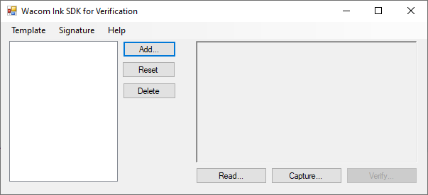
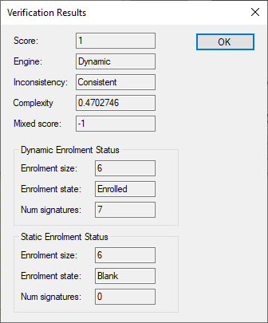
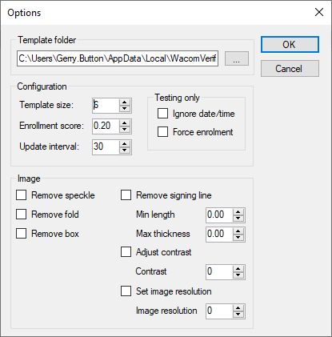

# Getting Started 

## Development Environment

The sample application is supplied for Windows 7 and above to demonstrate using the SDK.
Microsoft Visual Studio 2019 is required to build the application.


## Install the SDK

Run the MSI installer included in the SDK folder to install the necessary Wacom signature and Verification components. Choose the -x86 or -x64 installer for 32-bit or 64-bit operation respectively.

## License the application
A license is required to run the Verification application.    
A custom user license is supplied separately via email from *signature-support@wacom.com*

The license is supplied as a JWT text string and must be included in the application.
In the Verification sample code insert the string in the file main.cs:
```
private const string mLicense = "<<insert license here>>";
```

The license is subsequently used to license both signature capture and the verification engine:
```
  capture.Licence = mLicense;
  
  sigEngine.License = mLicense;
``` 


----
## Sample Code

The sample C# application is provided to assist with new development.

The following steps describe how to build and run the application:

* Ensure that .NET Framework 4.7.2 is installed for a successful build.
* Open the sample solution **WacomInkVerificationSample.sln** in Visual Studio 2019.
* set the project to build as **x86** if the -x86 SDK was installed
* set the project to build as **x64** if the -x64 SDK was installed
* build and run the application

The application displays its main dialog:



Check that the application has been successfully licensed using *Help...About*  
In addition to version information the dialog should report *Licensed Yes*


To use the application follow the steps:

* Select Add - add a new Template using a conventional filename
* Select the template in the dialog
* Select Capture to capture a signature from your device
* Select Verify to enroll the signature in the selected template - a dialog will report the enrollment status:


At any time the template status can be viewed using the menu option **Template...Status**


Once the sufficient number of signatures have been enrolled in a template, comparison results can be obtained:



### Options

The menu option **Template...Options** provides options for configuring the template:



### Read

Use the **Read** button or **Signature...Read file** to read a file into the signature area.
>  File **Drag and Drop** is also supported.

The file used for input can be one of the following types:

* Encoded signature image - the signature data is extracted from the signature image and treated in the same way as a live captured dynamic signature
* Unencoded signature image - the image is treated as a static signature image
* Scanned or imported signature image - the image is treated as a static signature image

### Verify

Depending on the status of the template the signature captured or read into the signature area is either used to enroll or verify the signature.

### SDK for Verification API

To view the API in parallel with the sample application select the option:
```
Start...Wacom Ink SDK for Verification...SDK Reference
```
The API is documented in the set of doxygen files.


### Troubleshooting

#### License

A suitable JWT license must be included in the application.
A suitable capture device must be connected to use the application and validate the license (e.g. STU-430).

#### Threads

The time taken to enroll and verify signatures is significantly affected by the number of threads available. This is particularly evident in default Virtual Machines.
**Threads.exe** supplied in SDK\Utils reports the number of threads available. The value reported should be greater than 2.


----
----


